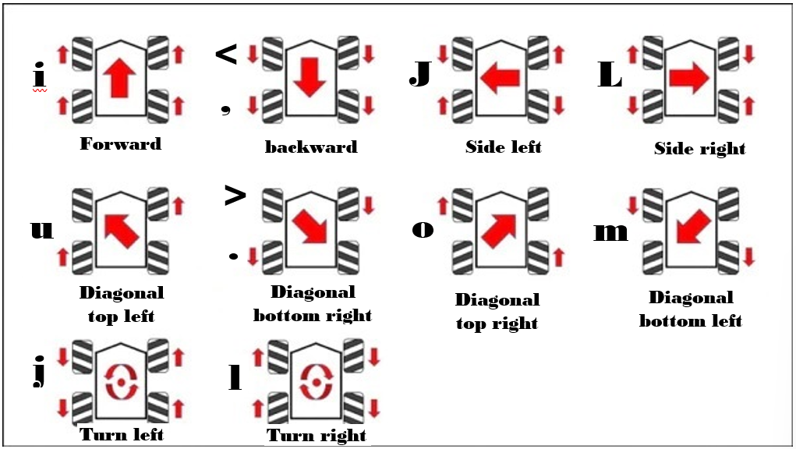
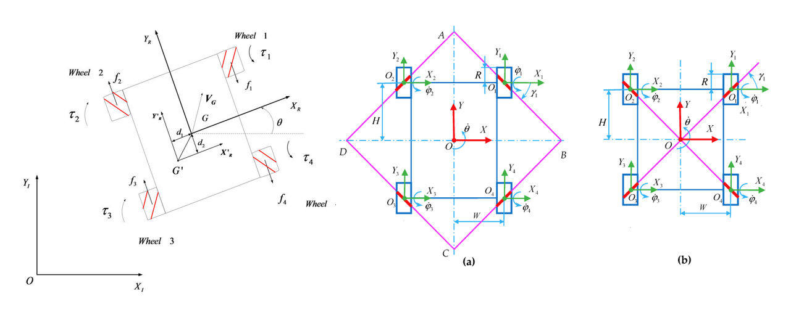

# move
<p>Modify from : https://github.com/ros-teleop/teleop_twist_keyboard</p>

```Python
moveBindings = {
        'i':(1,0,0,0),   # Forward
        'I':(1,0,0,0),   # Forward
        ',':(-1,0,0,0),  # backward
        '<':(-1,0,0,0),  # backward
        '.':(-1,-1,0,0), # Diagonal bottom right
        '>':(-1,-1,0,0), # Diagonal bottom right
        'j':(0,0,0,1),   # Turn left
        'l':(0,0,0,-1),  # Turn right
        'J':(0,1,0,0),   # Side left
        'L':(0,-1,0,0),  # Side right
        'M':(-1,1,0,0),  # Diagonal bottom left
        'm':(-1,1,0,0),  # Diagonal bottom left
        'U':(1,1,0,0),   # Diagonal top left
        'u':(1,1,0,0),   # Diagonal top left
        'O':(1,-1,0,0),  # Diagonal top right
        'o':(1,-1,0,0),  # Diagonal top right
    }
```
<p align="center">
  
</p>
<p align="center">
  
</p>

## Skid Steer / Differential Drive
<p>Here is some math for 2 and 4 wheel differential drive vehicles, 2 wheels and a castor, or skid steer tracked vehicles.</p>
<p><b>Arc based commands</b></p>
<p>The basic skid steer equations are:</p>

>velocity_right = w(RADIUS_OF_ARC_TO_DRIVE + WHEEL_BASE/2)
>
>velocity_left = w(RADIUS_OF_ARC_TO_DRIVE – WHEEL_BASE/2)

